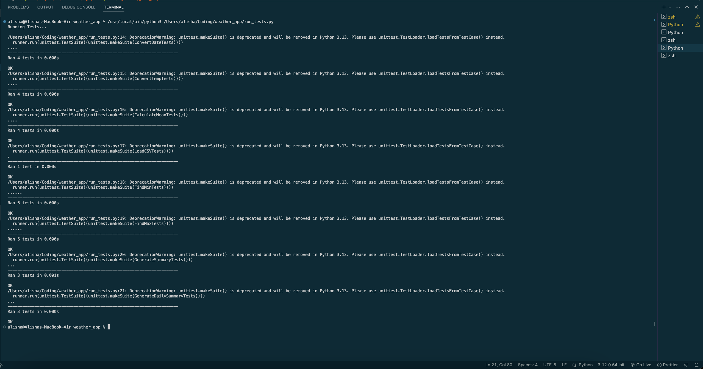

# weather.py
This project was part of the SheCodes Plus program. 

## Features
The application has the following features: 
- [X] Load data from CSV 
- [X] Convert date from an ISO string to a user friendly format
- [X] Convert fahrenheit to celsius
- [X] Calculate the average of temperatures
- [X] Calculate the min and max of temperatures
- [X] Generate a daily summary of dates with min and max temperatures
- [X] Generate an overview of multiple dates with the min temperature, max temperature, and avg min and avg max temperatures

### Testing Results
